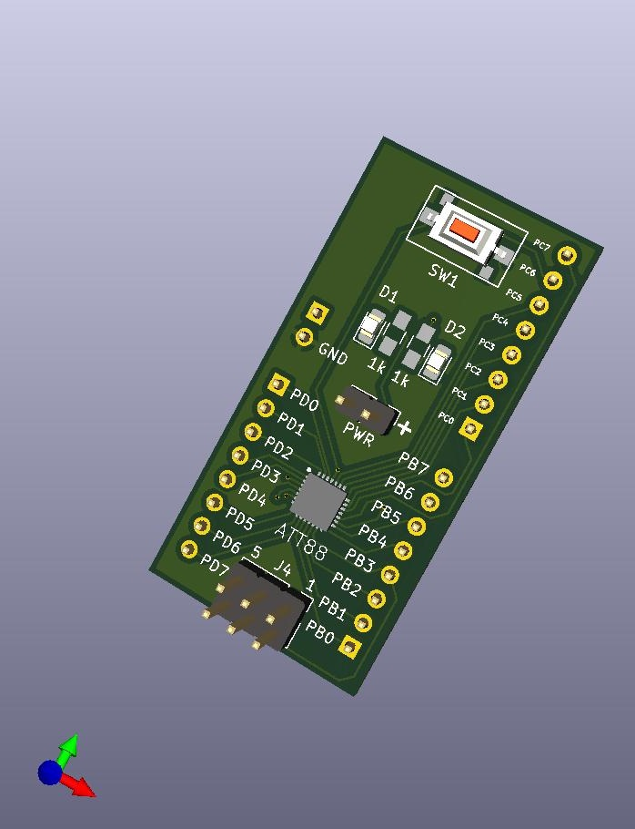

# ATTiny 88 Breakout Board
## What

This repo provides you with all KiCad files to build an ATTiny 88 breakout board.

## How

The breakout board has been designed with KiCad. This breakout board [project](Hardware/) can be opened with latest version [(download here)](https://kicad-downloads.s3.cern.ch/index.html?prefix=windows/nightly/). The board is double sided PCB.

## Technical details

### What’s on the board

The breakout board is made using ATTINY88-MMU (28 pin package.). It also connects to AVR 6 pin ISP.

## License

This project is realeased using **Mozilla Public License 2.0**
